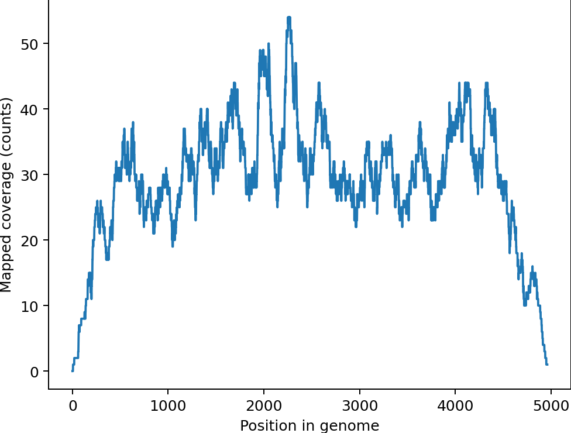
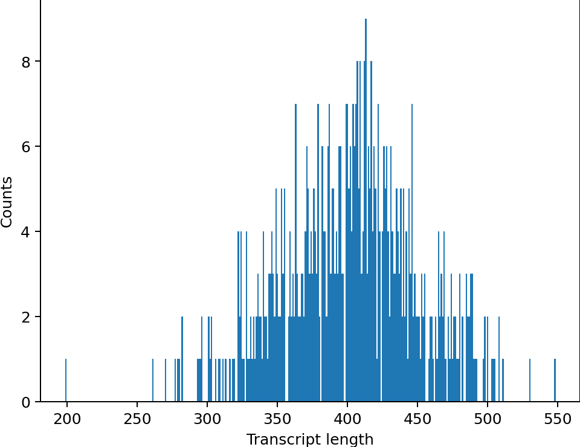

# Team03 solution manual

### Humpty Dumpty

Our aligner is called Humpy Dumpty (humdum).

    Humpty Dumpty sat on a wall,
    Humpty Dumpty had a great fall;
    All the King's horses
    And all the King's men,
    Couldn't put Humpty together again.


### Installation

The command
```{shell script}
cd solution
conda env create -f environment.yml
```
will create a new conda environment `Team03`.


### Usage

#### Creating an index and aligning reads

To put the reads 
on the provided **small dataset**
together again, 
run the aligner as follows:

```
cd solution

I="../input/data_small"
O="../output/data_small"

mkdir -p "${O}"

PYTHONPATH=. \
    python3 bin/humdum_aligner.py \
    "${I}"/genome*.fa \
    "${I}"/*30xCov1.fq "${I}"/*30xCov2.fq \
    > "${O}/alignment.sam"
```

This will first create an index file
in the same folder as the reference genome,
then output the SAM file.

The aligner reports at most one alignment per read.
This alignment may still be poor.


Run on the **large dataset** as follows.
It will take some 15min to create the index
before outputting the alignments.
Reading an existing index takes about 30sec.
After that, it will take a couple of weeks
to align 10M reads.

```{shell script}
cd solution

I="../input/data"
O="../output/data"
Cov=30

mkdir -p "${O}"

PYTHONPATH=. \
    python3 bin/humdum_aligner.py \
    "${I}"/genome*.fa.gz \
    "${I}"/*_${Cov}xCov1.fq.gz "${I}"/*_${Cov}xCov2.fq.gz \
    > "${O}/alignment.sam"
```


#### Metrics

To analyze the resulting SAM file, run:

```{shell script}
cd solution

O="../output/data_small"

PYTHONPATH=. \
    python3 bin/humdum_qc.py \
    "${O}"/*.sam "${O}"
```

This will create diagnostic figures in 
the output folder:

##### Coverage 


##### Mapped transcript length histogram


##### For the large dataset

Mutatis mutandis, in principle. 


### License

See [here](solution/license.txt).


## Team members

[RA](https://github.com/numpde/), LB, HK
